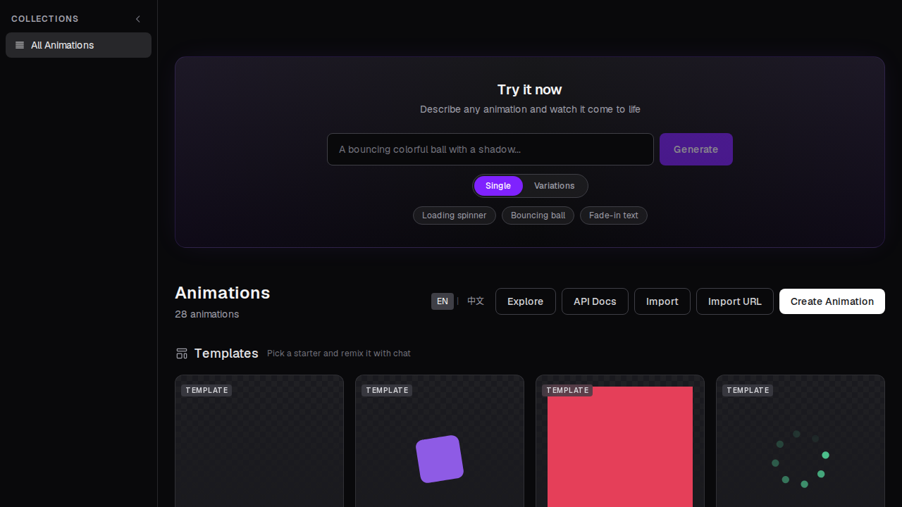

# Lottie Studio

**Create animations by chatting, not by dragging timelines.**


> Lottie Studio is a chat-driven animation creator where you describe what you want in plain language and an AI agent generates production-ready Lottie animations in real-time. No Lottie knowledge required, no JSON editing, no timeline dragging — just tell it what to build.

[**Try it live →**](https://lottie.kagura-agent.com)



---

## ✨ Features

### 🎨 Create

- **Chat-driven creation** — describe animations in natural language; the AI generates Lottie JSON with streaming responses
- **Voice input** — speak your animation idea with built-in speech-to-text
- **Prompt suggestions** — curated prompts across 4 categories (Getting Started, UI Components, Social Media, Branding) to spark ideas
- **21 starter templates** — ready-made animations across motion, rotation, scale, looping, opacity, decorative, UI, and more
- **`/random` command** — generate a surprise animation from curated creative prompts
- **Variation mode** — generate multiple style variants (playful, smooth, dynamic) from a single prompt and pick the best one
- **Design tokens** — set brand colors (primary, secondary, accent, background) with preset palettes; the AI uses them by default
- **SVG import + auto-animation** — import SVG files and the AI suggests & applies motion
- **Reference images** — attach images for vision-based animation generation
- **Auto-repair** — if the AI generates invalid JSON, it automatically retries with error context
- **Smart context** — conversation history is compacted to stay within token limits while preserving meaning
- **Selective Lottie spec injection** — injects only the relevant spec sections based on detected user intent

### ✏️ Edit

- **Live preview** with real-time WebSocket updates
- **Layer panel** — visibility toggle, opacity slider, drag-and-drop reorder
- **Layer commands** — `/layers`, `/duplicate-layer`, `/delete-layer`, `/rename-layer` for direct manipulation
- **Keyframe timeline** — visualize and scrub through keyframes with segment playback
- **Easing curve editor** — visual Bézier controls for fine-tuning motion curves
- **Color palette editor** — quick color changes across the animation
- **Duration & speed controls** — adjust timing with precision
- **Playback controls** — play/pause, speed (0.5×/1×/2×), loop modes (loop/once/bounce), frame scrubbing
- **Artboard size picker** — common presets + custom dimensions
- **Background picker** — checkered, white, black, or custom color
- **Style presets** — save, reuse, rename, and delete named motion patterns
- **Undo/redo** history
- **Version history** with one-click restore
- **Command palette** — Ctrl+K / Cmd+K for quick access to all actions
- **Fullscreen preview** mode
- **JSON editor** — collapsible CodeMirror 6 editor for fine-tuning
- **Quality panel** — file size, layer count, frame count analysis with optimization suggestions
- **Keyboard shortcuts** for all major actions

### 📤 Export & Share

- **Multiple formats** — JSON, `.lottie` (dotLottie), GIF, APNG, MP4, WebM video, TGS (Telegram sticker)
- **Size presets** — social media and web presets for one-click export at common dimensions
- **Shareable links** with Open Graph meta tags
- **Code snippets** — integration code for HTML, React, Vue, React Native, dotLottie, and CSS
- **Embed codes** — iframe and lottie-player snippets
- **Interactive embed modes** — scroll-bound, hover-to-play, click-to-toggle, cursor-tracking
- **Quick export from landing** — generate and export without opening the editor
- **Duplicate animations** to iterate on copies

### 🌍 Explore & Community

- **Explore page** — browse community animations with tag filtering and search
- **Sort options** — newest, oldest, name, most viewed, most liked
- **Featured spotlight** — highlighted animations on the explore page
- **Infinite scroll** — seamless browsing with IntersectionObserver
- **Remix** — fork any shared animation into your own with one click
- **Remix lineage** — track ancestry; remix count shown on explore cards
- **Related animations** — discover similar animations on share pages
- **Collections** — create named collections to organize animations
- **Bulk export** — export entire collections as ZIP
- **Likes & view tracking** — community engagement metrics

### 🔧 Developer Experience

- **RESTful API** — programmatic animation generation (`POST /api/generate`)
- **Variations API** — generate multiple style variants programmatically
- **WebSocket** for real-time animation updates
- **Code snippet generation** — copy-paste integration code for any framework
- **API documentation page** — interactive docs at `/docs`
- **Health endpoint** — `GET /api/health` for monitoring

### ♿ Accessibility & Polish

- **ARIA labels and roles** throughout the interface
- **Full keyboard navigation** — all actions accessible via keyboard
- **Reduced motion support** — respects `prefers-reduced-motion`
- **i18n** — full English and Chinese localization (445 translation keys)
- **Interactive onboarding tour** — step-by-step walkthrough for first-time users
- **Mobile responsive** — tab-based layout with touch-friendly controls
- **Custom error pages** — themed 404 and error pages with animated SVG illustrations
- **Dark theme** — dark-first design

---

## 🚀 Getting Started

### Prerequisites

- Node.js 18+
- npm

### Setup

```bash
git clone https://github.com/kagura-agent/lottie-studio.git
cd lottie-studio
npm install
npm run dev
```

Open [http://localhost:3000](http://localhost:3000) in your browser.

### Environment Variables

| Variable | Description | Default |
|----------|-------------|---------|
| `LLM_API_URL` | LLM API base URL (OpenAI-compatible) | `http://localhost:8000/v1` |
| `LLM_API_KEY` | API key for the LLM provider | — |
| `LLM_MODEL` | Model name | `claude-sonnet-4-6` |

---

## 🛠 Tech Stack

- **Framework:** Next.js 16 + React 19
- **Styling:** Tailwind CSS 4
- **Animation:** lottie-web
- **Database:** SQLite (better-sqlite3)
- **Real-time:** WebSocket (ws)
- **Code Editor:** CodeMirror 6
- **Export:** gif.js, canvas, JSZip
- **i18n:** next-intl
- **Testing:** Vitest

---

## 📡 API

### POST /api/generate

Generate a Lottie animation from a text prompt.

**Request:**

```json
{
  "prompt": "A bouncing red ball",
  "width": 512,
  "height": 512,
  "duration": 2
}
```

| Field | Type | Default | Description |
|-------|------|---------|-------------|
| `prompt` | string | *(required)* | Animation description (max 500 chars) |
| `width` | number | 512 | Canvas width in px (64–2048) |
| `height` | number | 512 | Canvas height in px (64–2048) |
| `duration` | number | 2 | Duration in seconds (0.5–30) |

**Response (200):**

```json
{ "success": true, "animation": { /* Lottie JSON */ }, "description": "..." }
```

**Errors:** 400 (validation), 429 (rate limit — 5 req/min), 500 (generation failure).

---

## 🚢 Deployment

Production builds run on a self-hosted VM behind a Caddy reverse proxy.

```bash
npm run build
npm start
```

The project includes a custom `server.ts` that handles both Next.js routing and WebSocket connections. Deployment is automated via GitHub Actions on push to `main`.

---

## 📝 License

MIT
